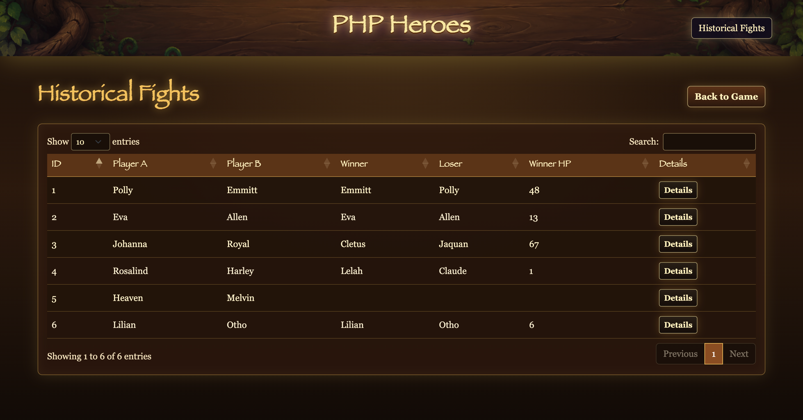
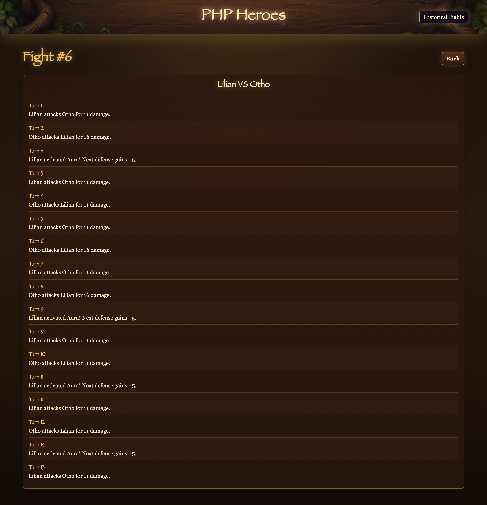
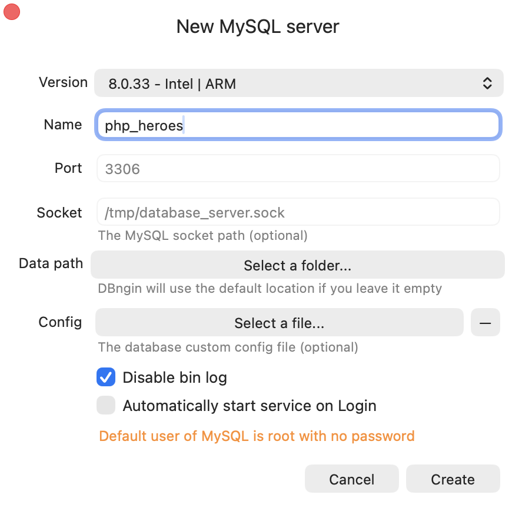

# PHP Heroes

**Live Demo:**
https://phpheroes.infinityfreeapp.com

**GitHub Repository:**
https://github.com/Alexey-Zanevsky/php-heroes.git

PHP Heroes is a turn-based browser game created with Laravel and Bootstrap.  
The application generates two random heroes with unique statistics and spells. Players fight each other until one hero wins the battle.

# Screenshots
## Start Screen

## Battle Screen

## Fight History

## Fight Details

# Technologies Used

- PHP 8.3
- Laravel 12
- Bootstrap 5
- JavaScript
- MySQL
- Vite
- DataTables

# Application Features

- Random hero generation
- Turn-based combat system
- Random spell system
- Battle logs
- Fight history
- Responsive user interface
- Dynamic UI updates using JavaScript and Fetch API

# System Requirements

Before running the project locally, make sure the following software is installed on your computer:

| Software | Required Version |
|---|---|
| PHP | 8.3+ |
| Composer | Latest |
| Node.js | Latest LTS |
| npm | Included with Node.js |
| MySQL | 8+ |
| Git | Latest |

# Recommended Tools

The project was developed using:

- Visual Studio Code
- DBngin (for local MySQL server management)
- phpMyAdmin / TablePlus / DBeaver (optional database management tools)

# How to run this game locally?

## 1. Clone the repository
Open terminal and clone the repository:

*git clone https://github.com/Alexey-Zanevsky/php-heroes.git*

## 2. Enter the project directory
In terminal:

*cd php-heroes*

## 3. Open the project in Visual Studio Code
You can write this in terminal:

*code .*

Or manually open the folder in VS Code.

## 4. Create a new MySQL server instance.
Open DBngin(in my case, you can choose another method to create a database).
Set the parameters as shown in the image

## 5. Install PHP dependencies
Return to the project terminal window. Run this command:

_composer install_

It installs all Laravel and PHP dependencies.

## 6. Install frontend dependencies
Run this command, to install bootstrap, vite, js packages:

_npm install_

## 7. Create the .env file
Run this command:

_cp .env.example .env_

Or manually copy the contents of the .env.example to .env file(create .env).

## 8. Configure database connection
Open the .env file and modify:

*DB_CONNECTION=mysql*
*DB_HOST=127.0.0.1*
*DB_PORT=3306*
*DB_DATABASE=php_heroes*
*DB_USERNAME=root*

*DB_PASSWORD=*

Adjust values according to your local MySQL configuration.

## 9. Generate Laravel Application Key
Run this command:

_php artisan key:generate_

It generates the application encryption key required by Laravel.

## 10. Run Database Migrations
Run this command to creates all required database tables:

_php artisan migrate_

## 11. Build Frontend Assets
Run this command:

_npm run build_

It generates production frontend assets inside the public/build directory.

## 12. Start Local Development Server
Run this command to start a local server:

_php artisan serve_

Example OUTPUT: INFO  Server running on [http://127.0.0.1:8000].

## 13. Open the App
Now you can open your browser and go to: http://127.0.0.1:8000.

# Main Application Routes
| Route              | Method | Description           |
| ------------------ | ------ | --------------------- |
| `/`                | GET    | Main game page        |
| `/start-game`      | POST   | Start a new fight     |
| `/fight-turn`      | POST   | Execute fight turn    |
| `/reset-game`      | GET    | Reset game state      |
| `/history`         | GET    | Fight history page    |
| `/history/{id}`    | GET    | Fight details page    |

# Project Structure
| Folder                 | Description                 |
| ---------------------- | --------------------------- |
| `app/Http/Controllers` | Laravel controllers         |
| `app/Models`           | Eloquent models (Fight, FightLog) |
| `app/Services`         | Game logic and spell system |
| `app/Providers`        | Service providers           |
| `resources/views`      | Blade templates             |
| `resources/css`        | Application styles          |
| `resources/js`         | Frontend JavaScript         |
| `routes/web.php`       | Application routes          |
| `database/migrations`  | Database migrations         |
| `database/factories`   | Model factories for testing |
| `database/seeders`     | Database seeders            |
| `public/`              | Public assets               |
| `config/`              | Configuration files         |

# Notes

The following files/directories are excluded from the repository:

- /vendor
- /node_modules
- .env

They are automatically recreated during installation.